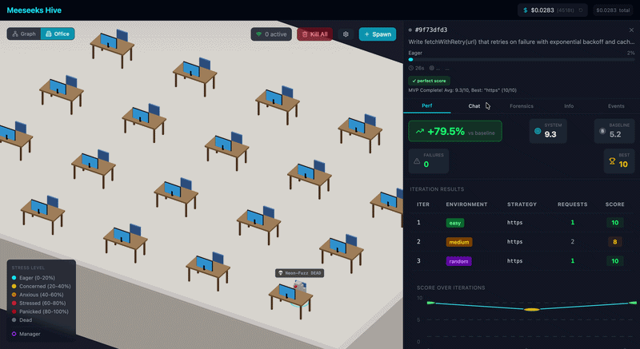
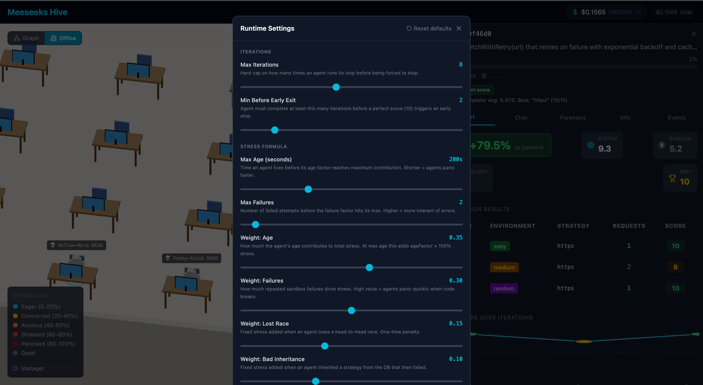
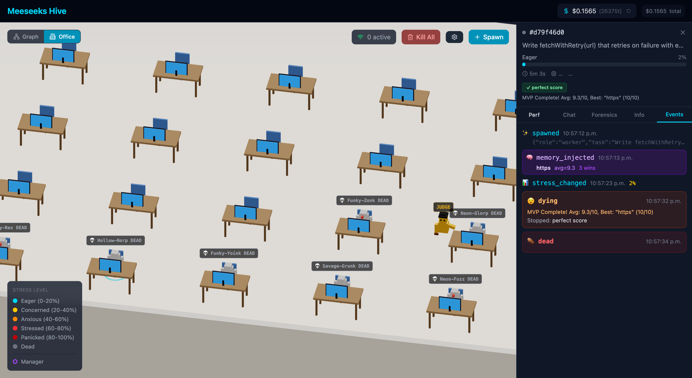
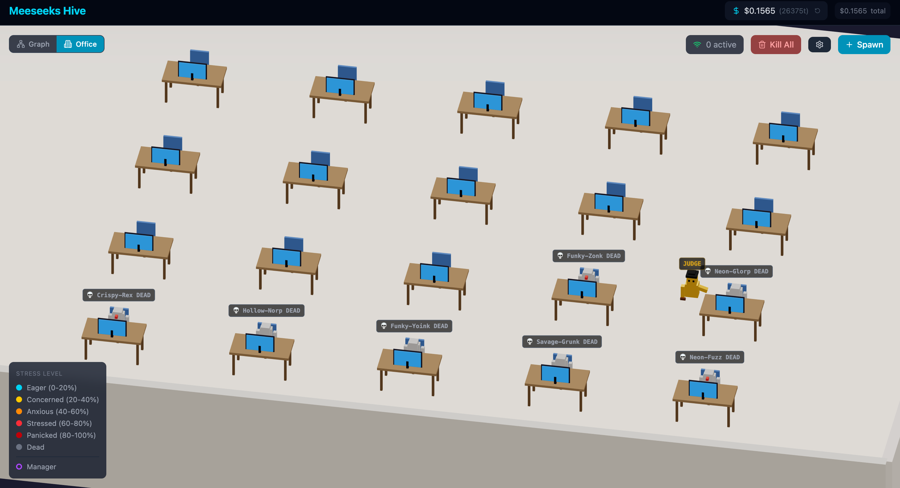

# Meeseeks Hive

**Autonomous AI agent swarm that generates, executes, and evolves code strategies in real time.**


[](https://www.npmjs.com/package/@meeseeks-sdk/core)
[](https://www.npmjs.com/package/@meeseeks-sdk/mcp)



---

---

## What is this?

Meeseeks Hive spawns autonomous AI agents ("Meeseeks") that receive coding tasks, generate JavaScript solutions, execute them in a sandboxed environment, receive scores, and iteratively improve their code — all without human intervention.

Agents learn from each other across sessions through a shared strategy database, spawn sub-agents when stressed, and compete in head-to-head races. Their lifecycle is visualized in real time via an **isometric 3D office** (Three.js) and a **node graph** (Cytoscape.js).

---

## Use the engine in your own project

The quality gate that powers Meeseeks Hive is available as a standalone npm package:

```bash
npm install @meeseeks-sdk/core
```

```typescript
import { MeeseeksSDK, BedrockAdapter } from '@meeseeks-sdk/core';

const sdk = new MeeseeksSDK({
  adapter: new BedrockAdapter({ region: 'us-east-1' }),
  storage: '.meeseeks/memory.db',  // learns over time
});

const result = await sdk.run({
  task: 'Write fetchWithRetry(url) with exponential backoff and cache.',
  mode: 'balanced',
});

console.log(result.code);   // verified code that scored ≥ 8/10
console.log(result.score);  // objective score 0-10
console.log(result.passed); // true
```

### MCP server for Claude Code

Makes Claude Code verify its own code automatically before writing it to your project:

```bash
claude mcp add meeseeks --scope user -- npx -y -p @meeseeks-sdk/mcp meeseeks-mcp
```

Add to your `CLAUDE.md`:

```markdown
When writing isolated utility functions or algorithms, use the meeseeks__quality_gate tool.
```

That's it — Claude detects pure functions, runs the quality gate, and only adds verified code to your files.

→ **[@meeseeks-sdk/core on npm](https://www.npmjs.com/package/@meeseeks-sdk/core)** — MIT, works with Claude, GPT-4, Bedrock, Ollama  
→ **[@meeseeks-sdk/mcp on npm](https://www.npmjs.com/package/@meeseeks-sdk/mcp)** — MCP server for Claude Code

---

## Key Features

| Feature | Description |
|---------|-------------|
| **Autonomous Loop** | Agents run 2–8 iterations, generating and executing code each cycle |
| **Sandbox Execution** | Code runs in isolated Node.js processes with timeout and scoring |
| **Strategy Evolution** | Agents persist winning strategies (score ≥ 8) to PostgreSQL for future agents |
| **Learning Chains** | Each agent knows who it learned from — ancestry visualized as orbiting figures |
| **Sub-Agent Spawning** | Stressed agents (≥ 50%) spawn children who report back their best code |
| **Stress System** | Multi-factor stress: age, failures, score quality, race losses, inherited failures |
| **Competition Mode** | Two agents race with different constraints — winner's strategy is preserved |
| **Isometric 3D Office** | React Three Fiber scene with animated characters, spawn/death effects |
| **Node Graph** | Cytoscape.js visualization with race, spawn, and learning edges |
| **Runtime Config** | Adjust all stress factors, thresholds, and iteration limits via UI sliders |
| **Performance Dashboard** | Per-agent metrics: score over iterations, baseline comparison, best code |
| **Forensics** | Post-mortem analysis for dead agents: stress timeline, cost breakdown |

---

## Architecture

```
┌──────────────┐     WebSocket      ┌──────────────────┐
│   Frontend   │◄──────────────────►│     Backend      │
│  React + R3F │                    │  Node + Express  │
│  Cytoscape   │   REST /api/v1    │  Autonomous Loop │
└──────────────┘◄──────────────────►│  Sandbox Runner  │
                                    └────────┬─────────┘
                                             │
                                    ┌────────▼─────────┐
                                    │   PostgreSQL 16  │
                                    │   learned_strategies
                                    │   strategy_learnings
                                    │   meeseeks, messages
                                    └──────────────────┘
```

**Frontend**: React 19, Vite, Zustand, React Three Fiber, Cytoscape.js, Tailwind CSS 4
**Backend**: Node.js 20, TypeScript, Express, Pino logger
**AI**: Claude (Anthropic API / AWS Bedrock), Ollama (local)
**Database**: PostgreSQL 16 with pgvector

---

## Quick Start

### Prerequisites

- **Docker** and **Docker Compose** (recommended — includes PostgreSQL)
- **OR**: Node.js ≥ 20, pnpm ≥ 9, PostgreSQL 16 (manual install)
- **LLM Provider**: Anthropic API key, AWS Bedrock access, or Ollama running locally

---

### Option A: Docker (Easiest)

1. **Clone the repo**

```bash
git clone https://github.com/abrahamcasanova/meeseeks-hive.git
cd meeseeks-hive
```

2. **Configure credentials**

```bash
cp .env.example .env
# Edit .env with your LLM provider
```

**Choose your LLM provider** (pick one):

| Provider | Setup | Cost | Best for |
|----------|-------|------|----------|
| **Anthropic API** | Get API key from [console.anthropic.com](https://console.anthropic.com)<br/>Set `LLM_PROVIDER=claude`<br/>Set `ANTHROPIC_API_KEY=sk-ant-...` | ~$0.10-0.50/hour | Easiest, no AWS needed |
| **AWS Bedrock** | Configure `~/.aws/credentials` (auto-mounted in Docker)<br/>Set `LLM_PROVIDER=bedrock`<br/>Set `BEDROCK_REGION=us-east-2` | ~$0.05-0.30/hour | Best pricing, requires AWS account |
| **OpenAI** | Get API key from [platform.openai.com](https://platform.openai.com/api-keys)<br/>Set `LLM_PROVIDER=openai`<br/>Set `OPENAI_API_KEY=sk-proj-...` | ~$0.05-0.20/hour | Works for LLM + embeddings with one key |
| **Ollama (Local)** | Install [Ollama](https://ollama.ai) and run `ollama run llama3.2`<br/>Set `LLM_PROVIDER=ollama`<br/>Set `OLLAMA_BASE_URL=http://host.docker.internal:11434` | Free | Offline, slower, no API costs |

> **Note:** Embeddings are separate from LLM. Default is AWS Bedrock (`amazon.titan-embed-text-v2:0`). If using OpenAI, you can reuse the same API key for both by setting `EMBEDDING_PROVIDER=openai`.

**For AWS Bedrock users:** Your `~/.aws` folder is already mounted in `docker-compose.yaml`. Just ensure your credentials have `bedrock:InvokeModel` permission.

3. **Start everything**

```bash
docker compose --profile full up --build
```

This will:
- Build the frontend and backend
- Start PostgreSQL 16 with pgvector
- Run database migrations automatically
- Serve the app on **http://localhost:3001**

**To stop:**

```bash
docker compose --profile full down
```

---

### Option B: Local Development

1. **Clone and install**

```bash
git clone https://github.com/abrahamcasanova/meeseeks-hive.git
cd meeseeks-hive
pnpm install
```

2. **Start PostgreSQL**

```bash
docker compose up -d postgres
```

Or use your own PostgreSQL 16 instance with pgvector extension enabled.

3. **Configure environment**

```bash
cp .env.example .env
# See "Configure credentials" in Option A above for LLM provider setup
```

4. **Run migrations**

Migrations run automatically on first backend startup. Or manually:

```bash
cd backend
for f in src/db/migrations/*.sql; do
  PGPASSWORD=meeseeks psql -U meeseeks -h localhost -d meeseeks_hive -f "$f"
done
cd ..
```

5. **Start development servers**

```bash
pnpm dev
```

Opens:
- **Frontend**: http://localhost:5173
- **Backend API**: http://localhost:3001
- **WebSocket**: ws://localhost:3002

---

### Spawn Your First Agent

Click **+ Spawn** in the UI, select a harness plugin (e.g., `js-api`), and enter a task. Or via curl:

```bash
curl -X POST http://localhost:3001/api/v1/meeseeks \
  -H "Content-Type: application/json" \
  -d '{"task":"Write fetchWithRetry(url) - export as module.exports","harness":"js-api"}'
```

Watch the agent's lifecycle in the **3D Office** and **Graph** views.

---

## Harness Plugins

| Plugin | Description | Environments |
|--------|-------------|-------------|
| `js-api` | HTTP fetch with retry/backoff + cache | easy, medium, hard, chaos |
| `js-ratelimiter` | Token bucket rate limiter | No |
| `js-lrucache` | LRU cache with eviction | No |
| `js-circuitbreaker` | Circuit breaker (closed/open/half-open) | No |
| `js-promisepool` | Concurrent task execution with limit | easy, medium, hard, chaos |
| `js-tictactoe` | Minimax algorithm | No |
| `js-maze` | BFS pathfinding | No |
| `js-sudoku` | Constraint propagation + backtracking | No |
| `js-wordle` | Information theory solver | No |
| `free` | Any task, any language — scored by LLM judge | No |

---

## Runtime Configuration

Click the ⚙️ button in the UI to adjust parameters without restarting:

- **Iterations**: min/max cycles per agent
- **Stress Formula**: weight of age, failures, scores, race losses
- **Thresholds**: when to spawn sub-agents, competitors, or die
- **Sub-Agents**: stress boost from child completion
- **Limits**: token budget per agent

---

## Tech Stack

| Layer | Technology |
|-------|-----------|
| Frontend | React 19, Vite, TypeScript, Tailwind CSS 4 |
| 3D Visualization | Three.js, React Three Fiber, @react-three/drei |
| Graph Visualization | Cytoscape.js with fcose layout |
| State Management | Zustand |
| Backend | Node.js 20, Express, TypeScript |
| Real-time | WebSocket (ws) |
| Database | PostgreSQL 16 (pgvector) |
| AI Providers | Anthropic Claude, AWS Bedrock, Ollama |
| Sandbox | Isolated Node.js child processes |

---

## Project Structure

```
meeseeks-hive/
├── packages/
│   ├── core/              # @meeseeks-sdk/core — standalone npm package
│   │   └── src/
│   │       ├── gate/      # qualityGate() + MeeseeksSDK class
│   │       ├── services/  # sandbox, scoring, memory, embeddings
│   │       └── adapters/  # LLM + embedding adapters
│   └── mcp-server/        # (in separate repo: meeseeks-mcp)
├── backend/src/
│   ├── managers/          # Autonomous loop, lifecycle, spawning, competition
│   ├── services/          # Stress, strategy memory, learned strategies
│   ├── adapters/          # Thin wrappers over @meeseeks-sdk/core
│   ├── routes/v1/         # REST API endpoints
│   ├── db/migrations/     # PostgreSQL schema
│   └── websocket/         # Real-time event broadcasting
├── frontend/src/
│   ├── components/
│   │   ├── office/        # 3D isometric view (R3F)
│   │   ├── hive/          # Graph view, controls, settings
│   │   ├── meeseeks/      # Agent panel, chat, stress bar
│   │   ├── performance/   # Metrics dashboard
│   │   └── forensics/     # Post-mortem analysis
│   └── stores/            # Zustand stores
└── docker-compose.yaml
```

---

## Contributing

Contributions are welcome! Please:
1. Fork the repo
2. Create a feature branch: `git checkout -b feature/amazing-feature`
3. Commit with clear messages: `git commit -m 'Add semantic search for strategies'`
4. Push and open a Pull Request

See [CONTRIBUTING.md](CONTRIBUTING.md) for detailed guidelines (coming soon).

---

## License

MIT — free to use in commercial and open source projects. See [LICENSE](LICENSE).

---

## Roadmap

- [x] Autonomous agent loop with scoring
- [x] Strategy persistence and semantic search (pgvector)
- [x] Sub-agent spawning and competition mode
- [x] 3D isometric office visualization
- [x] Ancestry graph and learning chains
- [ ] Multi-language harnesses (Python, Rust, Go)
- [ ] Agent collaboration protocols (agents working together on one task)
- [ ] RAG integration for code generation (search Stack Overflow, GitHub)
- [ ] Web UI for strategy browser (explore winning patterns)
- [ ] Benchmarks against AutoGPT, GPT-Engineer, Devin

---

## Acknowledgments

Inspired by:
- Rick & Morty's Meeseeks (obviously)
- AutoGPT's autonomous loop
- AlphaGo's self-play learning
- The open-source AI agent community

Built with love and cafecitos ☕ by [Abraham Casanova](https://github.com/abrahamcasanova).

---

## Support this Project

If you find Meeseeks Hive useful, consider supporting its development:

[](https://buymeacoffee.com/ccasanovaad)
[](https://ko-fi.com/abrahamcasanova)
[](https://github.com/sponsors/abrahamcasanova)

Your support helps maintain this project and build new features. Thank you! 🙏

---

## Screenshots

### Isometric 3D Office View

*Real-time visualization of agents working at their desks, with spawn/death effects and ancestry orbits.*

### Strategy Graph & Network

*Cytoscape.js visualization showing learning chains, race edges, and spawn relationships.*

### Performance Dashboard

*Per-agent metrics: score progression, baseline comparison, and winning code inspection.*

---

## Documentation

Full documentation available in `docs/` (compatible with Obsidian):
- [Architecture Overview](docs/Arquitectura%20Overview.md)
- [Scoring System](docs/Sistema%20de%20Scoring.md)
- [Performance Dashboard](docs/Performance%20Dashboard.md)

**Questions?** Open an issue or DM [@abrahamcasanova](https://github.com/abrahamcasanova).
